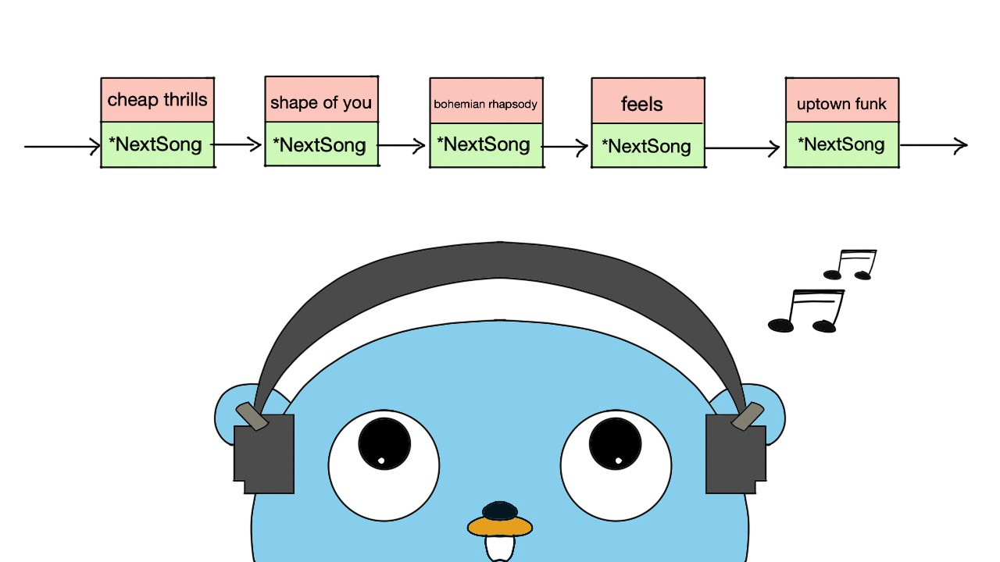

# Linked-List-Assignment
Python Linked List Assignment for my Embedded Software Development Module.

The objective for this Assignment was to simulate a personal music library system using the concept of Linked List. The program was to achieve the following functionality:

1. Adding a new item to the Linked List (options: beginning, middle or end)
2. Displaying all items in your Music Library
3. Searching for and display a song (you build the search options)
4. Searching for and display all items from a specific genre (i.e. pop, rock etc)
5. Deleting an item (Choices: 1. From Start, 2. From End 3. Search).

An overall functionality to tidy up the project was to display the above options as a menu to the user when the program was to be launched.

